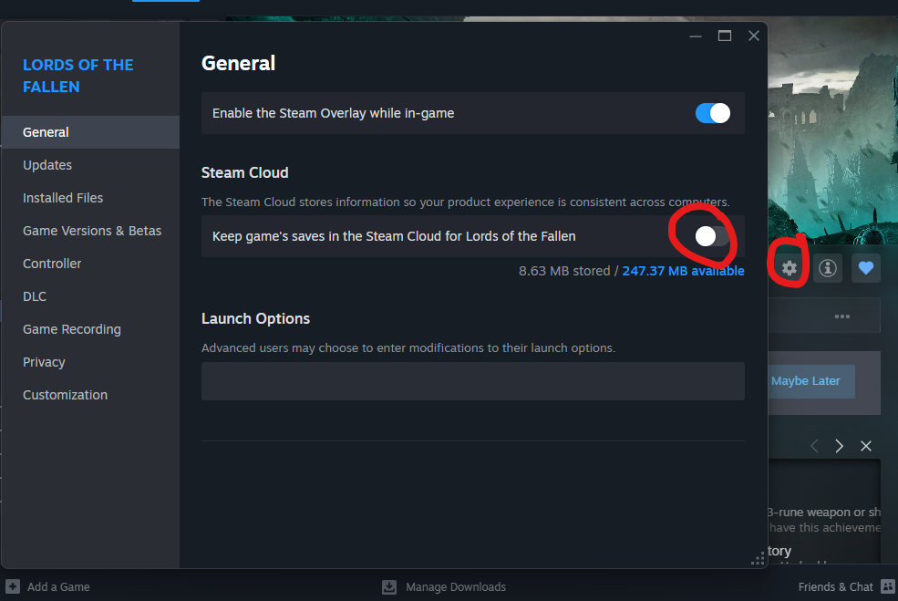
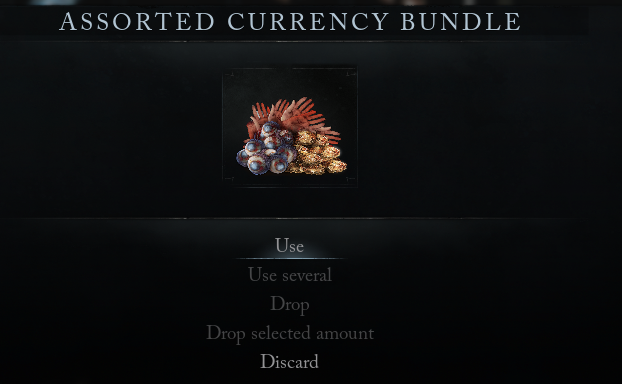
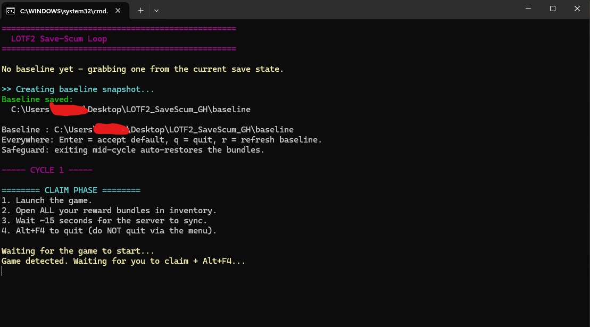
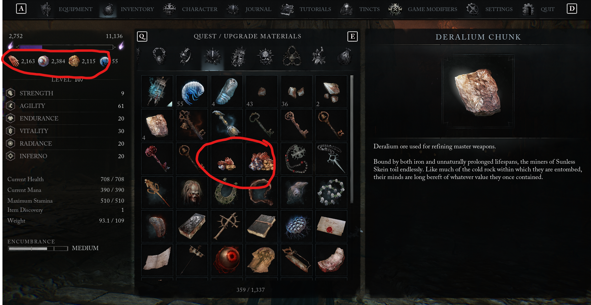
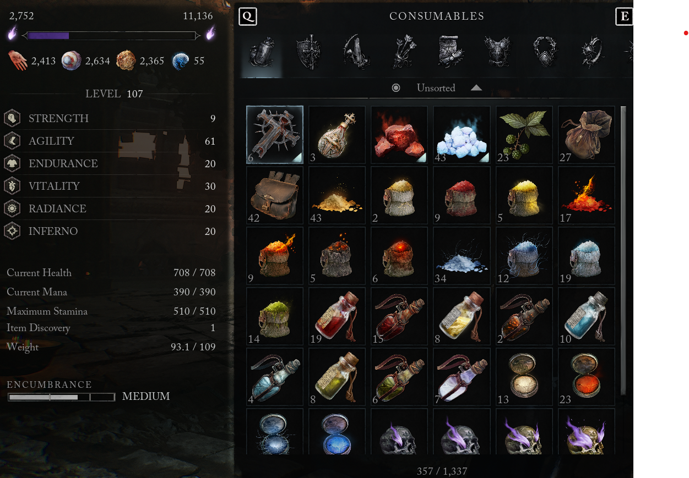
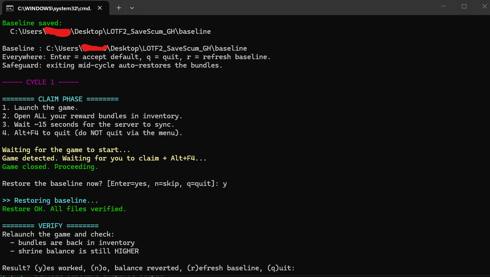
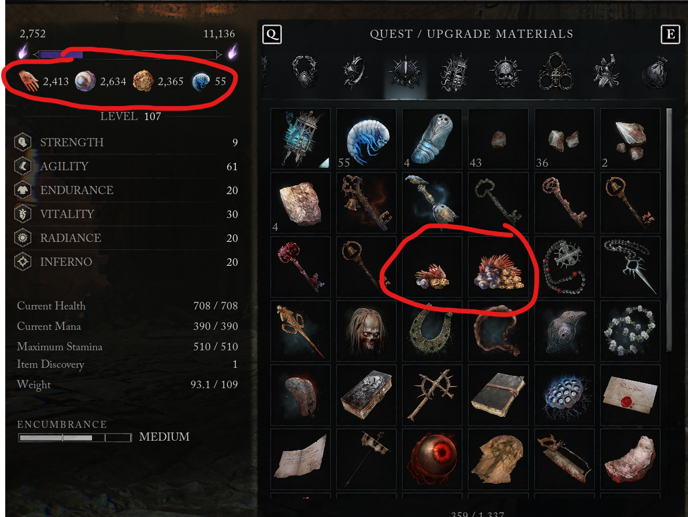

# LOTF2 Save-Scum Loop

A single, continuous Windows script that automates the **Crucible reward duplication
loop** in *Lords of the Fallen* (2023, Steam).

No game files are modified. The script only ever **copies** and **overwrites** the
local save folder (`%LocalAppData%\LOTF2\Saved\SaveGames`). The single exception is
the optional intro-skip tweak, which edits a game *config* file, never saves (see
[Optional extras](#optional-extras)).

> No license. All rights reserved. Use at your own risk.

---

## How it works (the bug)

Shrine currencies (**Pilfered Coins, Plucked Eyeballs, Severed Hands**) are synced
server-side, while the Crucible reward **bundles** live in your local save.

1. Beat Crucibles, keep the rewards **unopened**.
2. Snapshot the save.
3. Open the bundles server-side syncs your higher balance.
4. Restore the snapshot the bundle is back, but the server balance keeps the gains.

Each cycle nets the bundle value **again**. The loop is safe as long as your balance
**stays up** after a restore.

> **Minimum requirement: ONE unopened bundle.** That's the whole trick in a nutshell -
> the game only cares that the bundle *exists* in the restore, and your account balance
> only goes *up*. So one bundle can be farmed indefinitely:
>
> - 1 bundle worth 500 coins opened 10 times = 5000 coins on the same bundle.
> - 10 bundles opened 10 times = 100x value, same number of cycles.
>
> More bundles just mean fewer cycles per farm. The point is you never *lose* the
> bundle - it is always back after the restore.

*Since this relies on a server-authorized currency, a game update can patch it at any
time. The script tells you exactly what to check every cycle.*

---

## Prerequisites

- **Steam Cloud OFF.** Steam Library -> Lords of the Fallen -> Properties -> General ->
  uncheck *"Keep game saves in Cloud"*.

  **Why this is mandatory:** the whole trick depends on an old, local save file
  coexisting with a *newer* server-side currency balance. Steam Cloud is a "sync
  everything" system it has no idea which copy is the one you want, so it fights you:

  - If you restore the older local save while your cloud copy already holds the
    "claimed" state, Steam sees the mismatch and **re-uploads the live (claimed)
    save**, silently overwriting your restore -> bundles stay gone, loop broken.
  - Left enabled, Steam can also **pull the claimed cloud save back down** over a
    fresh restore, which looks exactly like the currency "reverting" and fools you
    into thinking the dupe is patched when it isn't.

  To re-enable it later (when you're done duping), just tick the box back on.

- The game fully **closed** before you run the script.
- **At least one unopened Crucible reward bundle** on your current save. The script
  amplifies whatever bundles you have - if you have none, do a couple of Crucible
  runs and *don't open* their rewards first.

---

## How to run

1. Put this folder anywhere (Desktop, USB stick, wherever).
2. Double-click **`run.bat`**.
3. Follow the on-screen prompts.

No installation, no admin rights, no absolute paths in the script
(it locates your save via `%LocalAppData%`).

---

## The loop, prompt by prompt

| Prompt | What to do |
| ------ | ---------- |
| *(startup, baseline exists)* `Refresh baseline?` | **Enter** to keep (resuming), `r` after playing normally / menu-saves |
| *(first run)* baseline snapshot | taken automatically from your current save state |
| `======== INTRO-SKIP ========` | status shown; **Enter** to keep as-is, **`t`** toggles it on/off |
| `===== CLAIM PHASE =====` | launch the game, open all bundles, wait ~15 s, **Alt+F4** |
| *(script waits automatically)* | it watches for the game process to close by itself |
| `Restore the baseline now?` | press **Enter** |
| `===== VERIFY =====` | relaunch and check bundles + balance |
| `(y)es worked` | back to CLAIM PHASE - next cycle, no re-backup |
| `(n)o, balance reverted` | the dupe stopped working - script restores + exits with a warning |
| `(r)efresh baseline` | take a new snapshot (after progress/menu-save) |
| `(q)uit` | stops safely at any prompt |

> **Critical rules**
> - Test with **one** bundle first.
> - If the balance ever *reverts*, the dupe is dead on your version. Stop.
> - **You can't waste bundles anymore.** If you `q` out mid-cycle or close the window
>   with Ctrl+C, the script auto-restores the baseline before exiting (see FAQ).

---

## Optional extras

### Skip the intro videos / faster launch

The script does this for you. At every startup it prints:

```
======== INTRO-SKIP ========
Status: APPLIED - launches skip the cinematics.
[Enter] keep it, [t] remove it
```

- **`t`** toggles the tweak on **or** off (works both ways).
- First application keeps your untouched `Engine.ini` as `Engine.ini.bak`. An
  existing `.bak` is never overwritten.
- Removing reverts the file byte-for-byte (it truncates the exact two lines it
  added); if the game has since rewritten the file it strips only those lines, so
  any other config changes you made are kept.
- Idempotent: applying when already applied (or removing when absent) does nothing.
- A game update may regenerate `Engine.ini` and wipe the tweak - just re-run and
  press **`t`** again.

The tweak boots the game straight into the menu, skipping the logo cinematics.
There is **no** Steam launch option that does this for LOTF (the
`+com_skipIntroVideo` / `+noIntroCinematics` tricks floating around belong to
other games).

Manual method (equivalent to what `t` does): append two lines to
`%LocalAppData%\LOTF2\Saved\Config\Windows\Engine.ini`:

```ini
[/Script/EngineSettings.GameMapsSettings]
GameDefaultMap=/Game/World/Character_Creation/LVL_Char_Creation.LVL_Char_Creation
```

Revert by deleting those two lines or restoring the `.bak`.

---

## Screenshots

**1. Steam Cloud toggle off** - Steam -> Properties -> cloud sync disabled.



**2. Unopened Crucible bundles in inventory** - the "before" state, bundles not yet opened.



**3. run.bat creating the baseline** - first run: baseline snapshot + checksums.



**4. Shrine balance before claiming**



**5. Shrine balance after claiming** - balance went up after opening bundles.



**6. run.bat restoring** - restore verified, all files PASS.



**7. Bundles back and balance kept** - the money shot: bundles are back, balance stayed high. Loop it.



---

## FAQ

**Do I need to re-backup every cycle?** No. One baseline is reused forever.
Only refresh (`r`) if you quit via the menu or made in-game progress you want to keep.

**Does it touch my other save slots?** Only the files that exist in the baseline
are deleted/restored. Other slots are left alone.

**Is this cheatable-detected / bannable?**  Use at your own risk; no anti-cheat guarantee is made.

**Why checksums?** Every restore is hash-verified so a failed copy can never
silently launch you into a corrupt save.

**What happens if I quit mid-cycle (q / Ctrl+C)? Will I lose bundles?** No. The
script tracks whether you've claimed bundles but not yet restored ("dirty" state).
On any exit it auto-restores the baseline first, so your bundles are always back.
If the game is somehow still running at that moment it won't overwrite the live
save - it warns you to Alt+F4 and re-run instead.

**Does that auto-restore ever touch my normal progress?** Only inside an active
dupe cycle. When you play normally between sessions (cloud on) the save is never
flagged dirty, so the exit guard leaves it alone.

**Can I start with just one bundle?** Yes - one unopened bundle is enough. Each
cycle re-claims it and stacks the balance. Farm a few bundles only to speed things
up, never because you need to.

**Does the intro-skip tweak affect the dupe?** No. It only edits `Engine.ini`
(loading straight to the menu faster) and is fully reversible. If a game update
wipes it, press `t` at startup to re-apply.

---

**Enjoy, and remember: if the balance reverts, it's over. Don't force it.**
